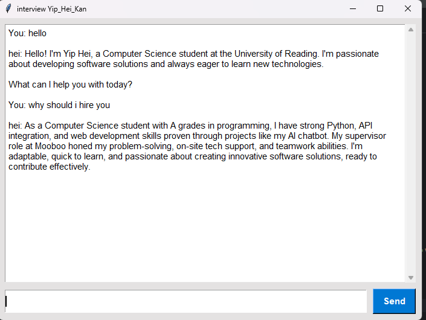

Personalised interview chatbot:
This project is a simple desktop AI chatbot that simulates an interview by reading my CV and asking me questions about my experience. It uses Google Gemini to understand the content of my CV and then interacts with me through a clean chat interface. It’s a useful way for me to prepare for interviews, improve my confidence, and get better at talking through my background and achievements.
Features:
- Reads CV automatically from a PDF
- Uses Google Gemini to role-play as me/you
- Clean and simple chat interface (Tkinter)
- Scrollable chat window for a smooth experience
- Keeps your API key secure through a `.env` file
- Reads your CV automatically from a PDF
- Uses Google Gemini to role-play as *you*
- Clean and simple chat interface (Tkinter)
- Scrollable chat window for a smooth experience
- Keeps your API key secure through a `.env` file

Techniqle Skills Used:
GUI: Tkinter 
LLM: Google Gemini API
Extracting: PyPDF2
python-dotenv

(please add my CV if you want to test the program , the name should be Yip_CV.pdf, i did not upload my cv on here on purpose:)
gemini key in env has been removed, you can fill your own gemini key to the env file, if you wanted to try it out.)

installation instuction:
run pip install -r requirements.txt
add your own api key to the .env file 

